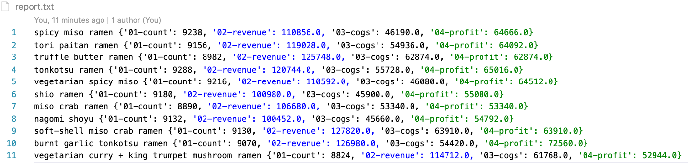

# How many ramen bento did you order?
### _PyRamen project revision on 01/07/2020_
Calculate profit for each type of Ramen dishes by
* Combining sales record with unit prices and costs by looping through lists
* store the result as a text file

---
## Files

[PyRamen](PyRamen_revised_01072020.ipynb)

[Report](report.txt)

## References
Columbia University Fintech Bootcamp